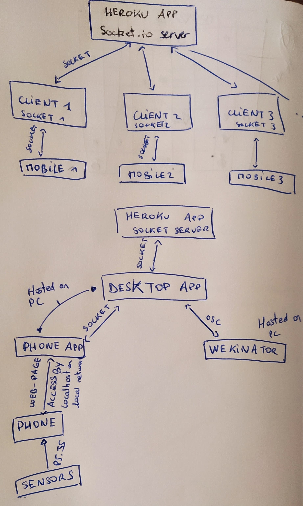

# Interactops
Using your phone as remote controller for your desktop to enable flexible cross-devices and human-to-human interactions.
This project use [Wekinator](http://www.wekinator.org/) to determine gestures from data stream sended by mobile devices.
We use [Socket.io]() to communicate between users and OSC with [node-osc](https://github.com/MylesBorins/node-osc) to communicate between our app to Wekinator (working on the synchronised computer).</br>
[Nut.js](https://github.com/nut-tree/nut.js) is used for desktop automation.

<details>
  <summary>Previous working process - First iteration</summary>
  
  > Following instructions are temporary. Example with a nodejs server isn't working well for now (only receiving), I've reused a Processing example to work on gestures for getting messages from the phone and sending to Wekinator. I can send them then to the nodejs server, but the goal is also to get data from phone on the nodejs server.

## Get data from built-in sensors on Android phone
1. Download oscHook on Android Store.
2. In the app, open menu (top right), click on ``OSC adress setup`` and enable only rotation data
3. On ``IP/ port setup``, choose the proper IP adress of your laptop and set the port on **12000**.
    > You can get your IP adress by running the script ipadress.js at the rook of the repo :
    > ```
    >    node ipadress.js
    > ```
4. Set OSC timing to 50ms.
5. Ensure that your phone and your computer are on the same network and start recording.

## Get data on laptop with Processing
1. Open the Processing sketch : ``osc_phone_to_wekinator``.
2. Ensure that you're listening the port 12000:
```java
    oscP5 = new OscP5(this,12000);
```
3. Ensure that you're sending to the port 6448 of your localhost:
```java
    myRemoteLocation = new NetAddress("127.0.1",6448);
```

## Get data on laptop with Nodejs
1. Go to the ``app`` folder and install dependecies : ``` npm install```
2. Ensure that you're listening ports 12000 (for mobile device), 12001 (for Wekinator), and sending on the 6448:
```javascript
    const dashboardHost = 3000;
    const externalDevicesHost = 12000;
    const wekinatorGetHost = 12001;
    const wekinatorSendHost = 6448;
```
> We split mobile device & wekinator inputs to avoid overloading on the port (phone should send data each 50ms). 
3. Run the desktop app and open the gestures dashboard in your browser : ``localhost:3000``:
```
    npm run start
```

## Run models on Wekinator
1. Open the project in ``wekinator / interactops`` in Wekinator.
2. Ensure that it is listening the port 6448 ( View > OSC receiver status > port & start listening)
3. Ensure that it is sending messages on port 12001 (View > OSC outputs)
4. On the main window, if you're alreading sending data on the port, the pin OSC in should be green.
5. If so, you can train new models (each line of the **gestures** array) : 
    - click on ``+`` as near as possible of your gesture. The number of examples should increase of one on the right.
    - click on ``-`` to remove the last record
    - Around 15-20 trainings should be enough to start
    - Always train a blank model because Wekinator always compare all of the recorded models which one is the nearest one. This blank one will serve to get undesirables values
6. When yours models are trained, you can ``Run`` your project and check that yours gestures are recognized.
7. You can define the threshold match with the slider on the bottom side of the window to allow easy gesture recognition without getting too much noise.

> For further explanations of how Wekinator works, check their explanations : [Wekinator wiki](http://www.wekinator.org/detailed-instructions/). Check the **Time warping** section (for recording data variance in time).


## Remote desktop control using Nut.js

> Nut-js need different setup according to your OS, please follow the instructions of the official documentation before start.

Official documentations here : [Nut.js](https://github.com/nut-tree/nut.js)

A test example has been proved on Fedora 32 (Unix), holded in the folder ``desktop-control``.

```
cd desktop-control
npm install
node index.js
```


### Documentation of Nut.js

- [Keys](https://nut-tree.github.io/nut.js/enums/key.html)
</details>

## Install Interactops app (cross-plateform)
1. Install app dependencies : 
    ```
    cd app
    npm install
    ```
2. Run Interactops app
    ```
    npm run start
    ```
3. An url of the following format should be displayed in your console :
``Try to connect to this url on your phone : http://192.168.1.XX:3030``.
4. Open your browser (Chrome or Firefox preferred) on your mobile companion and type this url.
5. The Interactops companion web-app shoud be enabled.

## Enable gesture recognition using Wekinator
1. Open [Wekinator](http://www.wekinator.org/) and load project file in ``wekinator / interactops / interactops-[last one]`` in Wekinator.
2. Check that Wekinator listens the same port as your app is sending (should be ``6448``). The ``OSC in`` pin should be green when it is fine.
3. Hit ``Run`` button to enable gesture recognition. The ``OSC out`` pin should be green when messages are send.

## Implemented gestures
To perform a gesture, you'll need to connect to the companion adress url, and **touch the screen to enable gesture detection**.
Following namespaces of the gestures will be send by Wekinator when one of them is recognized. You can check it either on Wekinator's GUI, either in the console, either on your companion app.

### Share-throw
This will copy the selected content (either text or file, folders aren't implemented yet) on your computer and send it to the server for one person. Your collaborator will be able to get it by executing a ``share-get``.


### Share-multi
This will copy the selected content on your computer and send it to the server. Yours collaborators will be able to get it by executing a ``share-get`` gesture.


### Share-get
This will store the shared content in your PC's clipboard, waiting for paste it somewhere. If it is a file, it will be downloaded in the ``store/assets`` folder.


### Access-viewer
Share your viewer token to the server if you are the first to perform the gesture. If it is executed in second or more, it will download the shared tokens if no more action if provided. If the gesture is performed another time, it will override the shared token. While you are sharing or casting your computer, it will close the connection.


### Access-collaborator
Same as viewer but for collaboration. When you got access to another computer, you can perform every action except : ``acces-viewer``, ``access-collabortor``.


### Swipe-right
Fake a arrow-right press.


### Swipe-left
Fake a arrow-left press.


### Change-control-mode
Toggle mode between gesture detection and mouse control. Once mouse mode is activated, you can control mouse by rotating on the X and Z axis. A double tap on screen will fake a click. </br>
While you controlling the mouse, other gestures are disabled to avoid fake-positives.


### Changing window
**Double tap** on phone's screen to clutch, and perform a ``swipe`` gesture to change current window. Double tap to end.

### Casting your computer screen
You can also cast your computer (or remote paired computer) on your phone by **triple-tap** on your screen.


## Principle diagram


## Testing our prototype 
The user test process is described [here](./user-tests/user-test_script.md)

## Contents
- This repository holds the Interactops desktop app and its mobile companion into the ``app`` folder.
- The ``network`` branch holds the Websocket server running on [Heroku](https://interactops.herokuapp.com).
- ``wekinator`` subrepo contains saves of the wekinator model you should load in it before using Interactops (use last version avalaible).
- ``user-tests`` contains our user test process, as well as our interview materials.