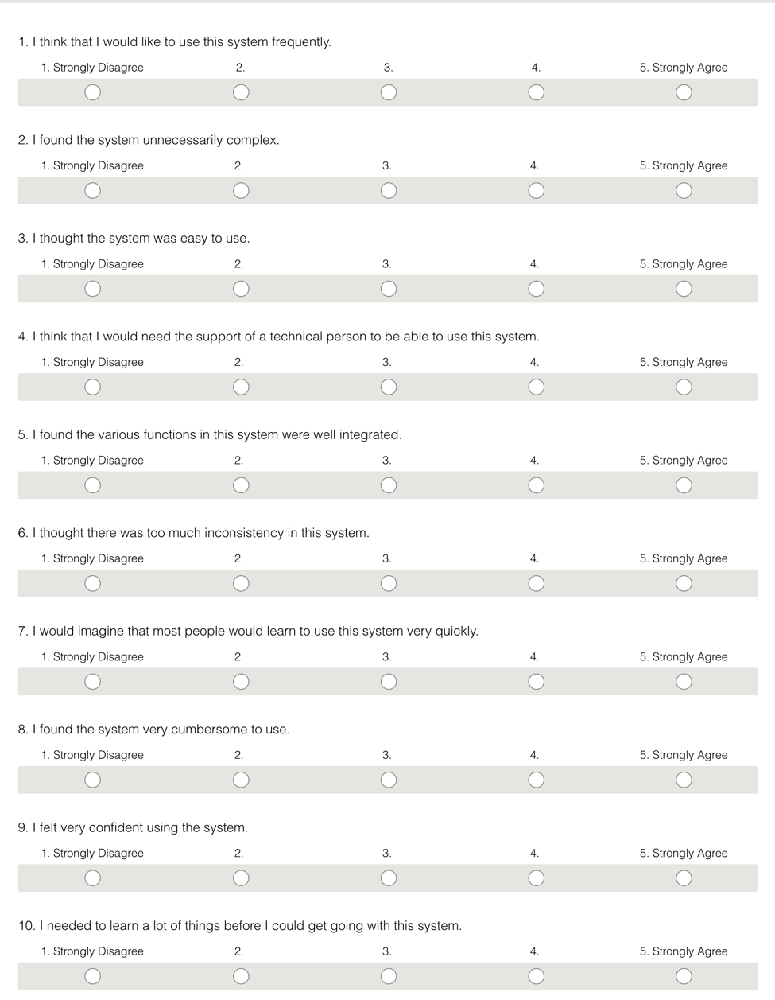
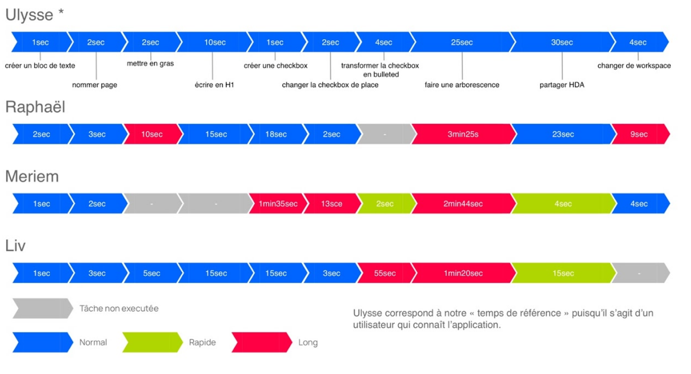
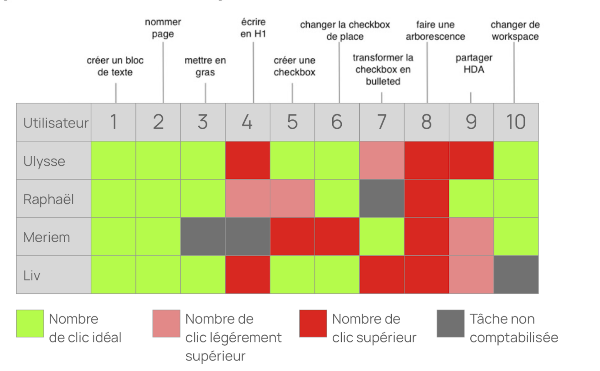
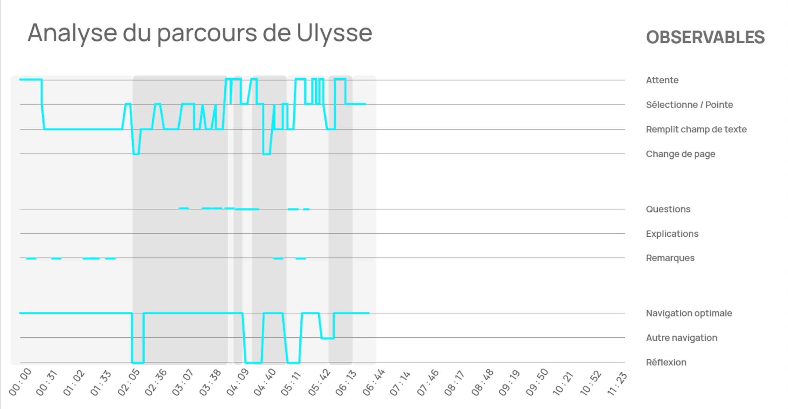
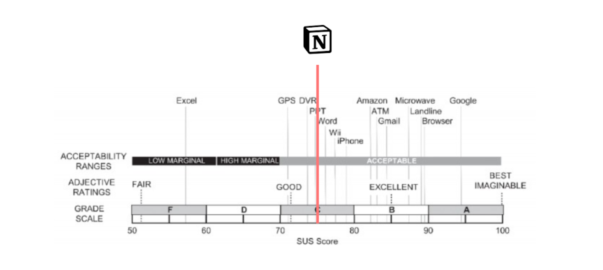

# Test Protocole
This protocole aim to measure different parameters, objectives and sub-objectives to define the potential of usability by new users.
First, it will measure the efficiency and reliability of our prototype for remote desktop control.
Then, the test will switch on qualitatives questions in order to be explicit using words, feelings,about how our prototype is embedded in normal behaviors.

## Objectives (Return On Investment)
> What's ROI ? See the [Interaction Design Foundation's article](https://www.interaction-design.org/literature/topics/return-on-investment)

|   KPI   |     GOALS      |    METRIC(s)   |   SIGNALs     |
|---------|----------------|----------------|---------------|
|   Task-success average |  Determine system accuracy   |   Time spent, success, help needed    |   Performing correct gesture and get feedback 
|   Adoption    |   Determine affordance    |   Verbalization, success, SUS test  | Describing gesture to do, comparison rate between imaginated one and given one   
|   Task-success | Understand every gestures | Verbalization, Usability scale  | Performing correct gestures
|   Task-success | Understand context-specific interactions | Task success, verbalization, help needed | Performing correct gestures
|   Adoption    |   Understand advantages of remote control | Usability scale, Verbalization | Conversion rate (between normal action & prototype gestures)
|   Adoption    |   Enable more flexible interpersonal relations    | Usability scale, Verbalization, Time spent    | Conversion rate

## Introduction

> This is a first survey to fix your possible experiences with some remote desktop controllers.

1. Surname, Name
2. Work Field
3. Do you keep your phone close to you when you work on your computer ?
4. Have you already experienced some gestures with your phone ? Enabling a feature without intreacting with the screen ?
5. How much do you interact with you phone when using your computer? 
6. Have you already used a presentation controller ? (Kinda a TV command for PC)
7. Did you use any phone companion for your OS ? (eg. KDE Connect for Linux or Phone Assistant on Windows or a MacOS specific).
8. If so, which features were embedded ? What did you miss when using them ?

## User Scenario

> The scenario is splitted in X parts. Before starting each part of the usability test, you would be asked how would you imagine some kind of interactions. I  Please answer as naturally as possible, any ideas that come up from your experience, will be compared with the ones you exposed to you during this part of the scenario.

> Usuability Tests will be starting. For this, a scripted narration will be followed to make you discover step by step the prototype, so you will have to face differents situations to perform actions which can be general or specific to the given context. Please, make sure to verbalize and explain as much as possible your thoughts, to describe even something that could appear useless to you or saying at loud that how to do the asked task.

### Ideal Scenario

|   Task ID     |   Task description    |   Time spent  |   Attempts    |
|---------------|-----------------------|---------------|---------------|
|       1       |   Unlock computer with the following pattern  | 00:23 | 4

### Part 1

> How would you imagine the following gestures ?
Different set of gestures are easily explained to the testers. For example:
 - Sharing Gesture with your phone
 - Go to the next slide
 - Unlock your computer
 - Share your screen with other people
 - Share your screen to an audience

### Part 2

> The testers give their feedback and different opinions on what would be the best gesture for each of the ones exposed above.
Taking that feedback, we then give them all a phone so they can try their own gesture for each of the ones proposed from the part of the team.
Each of the individual gestures from each tester was monitored and saved, and then the testers were asked to do a little explanation of their own gestures.

### Part 3

> After the testers make their own gestures following their own imagination and what would fit best according to their ideals, the team now gives them a set of orders to follow for each of the gestures mentioned.

 - Sharing Gesture with your phone: One person in front of the other doing an upwards movement with your phone in hand to share a file in this case, and the receiver has to do the same or opposite movement, as he/she is receiving the file.
    - For sharing, before that the participants have to follow a list of tasks:
        1. Open a document type text.
        2. Copy and share it with the person in front of you.
        3. The person receiving the document has to register the data in their own documents.
        4. After this, the sharing has been completed. 
 
 - Go to the next slide: As your phone is connected to the computer, do a movement with your arm moving to the right if you want to go the previous slide; do the counter movement, move your arm to the left if you want to go to the next slide. Obviously, everything with the phone in your hand.
    - Before changing slides, the participant must follow these steps:
        1. Sync your device with the computer
        2. Get the slides or the program with it
        3. Once you have them loaded, the participant should move his arm to the right or to the left to go on to the next or to the previous slide.

 - Unlock your computer: Do a set of default movements to unlock the computer in front of you, as this should not require more than to 4 to 5 movements, they were given different figures so they can replicate them with their arm movement while having the phone.
 A computer was provided to each participant, and each of the computers had different set of movements to unlock it.

   The set of movements were the following:
   - Triangle
   - Square
   - Circle
   - An 'X'
   - A Circle and then an 'X' crossing the circle.
    After doing these movements in the adequate way, the computer should be unlocked.

 - Share your screen with other people (close distance): Turn your phone sideways (the ones the screen has been shared have to do the same movement too), then  the phone will detect the phones that are turned in this way because they are not looking in the normal direction a smartphone is hold (that is looking upfront). This movement by the sharer and the one been shared is also a confirmation, if you do not want to be shared-screen just do not hold your phone horizontally looking into X direction and being in a close distance to the screen-sharer.

 - Share your screen to an audience (medium-long distance): Turn your phone sideways and do a movement from left to right or from right to left, trying to include the whole room with this movement. As for the ones receiving this shared-screen, you just need to turn your smartphone sideways/horizontally. After a brief moment, the sharing will commence to the ones that have their phones hold in the "correct" way.
    
    - For sharing in a correct way, the participants should have firstly loaded the information or the video, or whatever media they wanted to share with the people. After selecting these media, now select one piece of it to share your screen. For the part of the receivers (audience or close people), they just need to have their device unlocked and in a horizontal way (the sender also has to hold his phone this way, but after sharing screen, the sender can have the phone hold vertically), to accept the screen sharing, if it is not hold this way, it won't  receive the shared-screen, this is a method to accept it. 
 
## Part 4

> After testing all the gestures given to the testers, we asked them to complete a survey and also to compare now their own movements for each gestures to the ones given by the team. 

The team and the participants have a discussion comparing which is the most suitable movement and if they (the participants) would change anything in the gestures proposed by the team, also adding a voting system between which one is the best gesture between the ones done by the participants and the ones given by the team. Following this voting process, the team takes this information and tries to improve, if possible, the already made gestures.

##  Debriefing

> Can you please feel the following survey about your experience during the usability test.

### How to calculate SUS test ?
 - For odd items : ``final_score = [score] - 1``;
 - For even items : ``final_score = 5 - [score]``;
 - **Total :** ``total scores * 2.5``
Give a 0 to 100 score for each participant. We need now to make the average to have a global SUS score.

### Completing sentences about the prototype

## Analysis Results

The following example are in French, but give an idea of how to structure data to be able to exploit them.

### Task-Success

### Time Spent
Blue was a normal duration for the asked task, green a task performed quickly and a red means that the tasks takes longer than expected.
Here the first user was our reference user for the time we considered that every of him performed tasks took a normal time.

### Attempts
The following graph was counting the clics on a web product. We can adapt it to the attemps made for the needed task.

### Journey Analysis
For this one, we have selected observables as actions (eg. waiting, pointing, filling an input, navigating...), vocal behavior (eg. asking, explanations, remarks) and the navigation status (optimal navigation, reflexion times) to highlight the difficulties in the process, common steps where users have troubles with.

### Test SUS
A snapshot to give a non-truthful comparison with others studies conducted on famous softwares. A straight comparison would not be acceptable because tests were not conducted in same conditions, but it still gives an idea :

### Words cloud

Highlight some interesting sentences and keywords pronounced during the interview (jouney or questions), or from the sentences to fill. The sentences to fill aims to define a semantic field from users on the experience, given prototype, possibilities they imagine and how they feel confident when using it.
