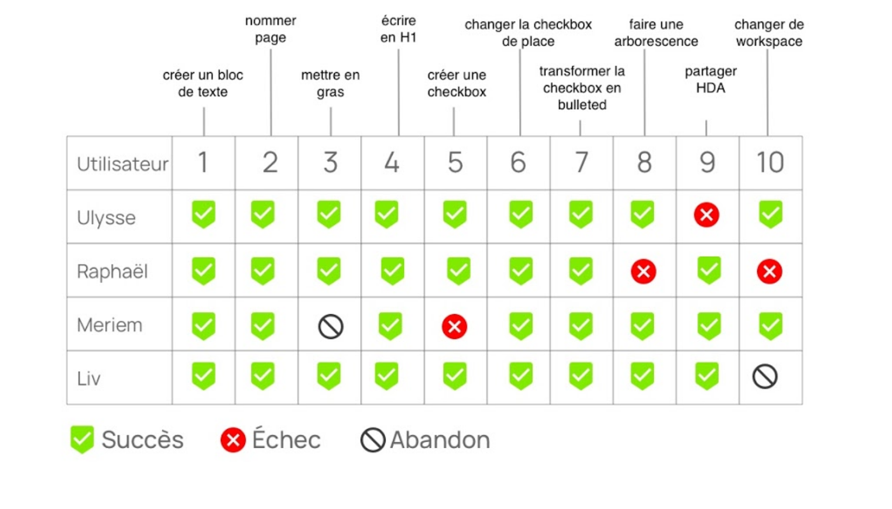

# Test protocole
This protocole aim to mesure differents parameters, objectives and subjectives to define the potential of usability by new users.
First, it will mesure the efficiency and reliability of our prototype for remote desktop control.
And then, the test will switch on qualitatives questions in order to explicit by words, feelings, how our prototype is embeeded in normal behaviors.

## Objectives (Return On Investment)
> What's ROI ? See the [Interaction Design Foundation's article](https://www.interaction-design.org/literature/topics/return-on-investment)

|   KPI   |     GOALS      |    METRIC(s)   |   SIGNALs     |
|---------|----------------|----------------|---------------|
|   Task-success average |  Determine system accuracy   |   Time spent, success, help needed    |   Performing correct gesture and get feedback 
|   Adoption    |   Determine affordance    |   Verbalization, success, SUS test  | Describing gesture to do, comparison rate between imaginated one and given one   
|   Task-success | Understand every gestures | Verbalization, Usability scale  | Performing correct gestures
|   Task-success | Understand context-specific interactions | Task success, verbalization, help needed | Performing correct gestures
|   Adoption    |   Understand advantages of remote control | Usability scale, Verbalization | Conversion rate (between normal action & prototype gestures)
|   Adoption    |   Enable more flexible interpersonal relations    | Usability scale, Verbalization, Time spent    | Conversion rate

## Introduction

> This is a first survey to fix your possible experiences with some remote desktop controllers. Feel free to add any other informations if you think it has importance.

1. Name, Firstname
2. Work field
3. Do you keep your phone close to you when you work on your computer ?
4. Have you already experienced some gestures with your phone ? Enabling a feature without intreacting with the screen ?
5. Have you already used a presentation controller ? (Kinda a TV command for PC)
6. Did you use any phone companion for your OS ? (eg. KDE Connect for Linux or Phone Assistant on Windows or a MacOS specific).
7. If so, which features are embeeded ? What do you miss in your use ?

## User scenario

> The scenario is splited in X parts. Before starting each part of the usability test, I'll ask how you would imagine some kind of interactions. I'd like you answer as naturally as possible, every ideas that come up in order that you will compare them with the ones you will meet during this part of the scenario.

> We'll start usability tests. For this, we'll follow a scripted narration to make you discover step by step the prototype and you'll have to face differents situations to performs actions which can be general or specific to the given context. Please make sure to verbalize as much as possible your thoughts, to describe even something that could appear useless to you or saying loud that you're looking for how to achieve the asked task.

### Ideal Scenario

|   Task ID     |   Task description    |   Time spent  |   Attempts    |
|---------------|-----------------------|---------------|---------------|
|       1       |   Unlock computer with the following pattern  | 00:23 | 4

### Part 1

> How would you imagine the following gestures ?

### Part 2

### Part 3

##  Debriefing

> Can you please feel the following survey about your experience during the usability test.

### How to calculate SUS test ?
 - For odd items : ``final_score = [score] - 1``;
 - For even items : ``final_score = 5 - [score]``;
 - **Total :** ``total scores * 2.5``
Give a 0 to 100 score for each participant. We need now to make the average to have a global SUS score.

### Completing sentences about the prototype

## Results analysis

The following example are in french, but give an idea of how to structure data to be able to exploit them.

### Task-success

### Time spent
Blue was a normal duration for the asked task, green a task performed quickly and a red means that the tasks takes longer than expected.
Here the first user was our reference user for the time we considered that every of him performed tasks took a normal time.

### Attempts
The following graph was counting the clic on a web product. We can adapt it to the attemps made for the needed task.

### Journey analysis
For this one, we select observables as actions (eg. waiting, pointing, filling an input, navigating...), vocal behavior (eg. asking, explanations, remarks) and the navigation status (optimal navigation, other one, reflexion times) to highlight the difficulties in the process, common steps where users has troubles with.

### Test SUS
A snapshot to give a non-truthful comparison with others studies conducted on famous softwares. A straight comparison wouldn't be acceptable because tests weren't conducted in same conditions, but it still give an idea :

### Words cloud

Highlight some interesting sentences and keyword pronounced during the interview (jouney or questions), or from the sentences to fill. The sentences to fill aims to define a semantic field from users on the experience, given prototype, possibilities they imagine and how they feel confident when using it.